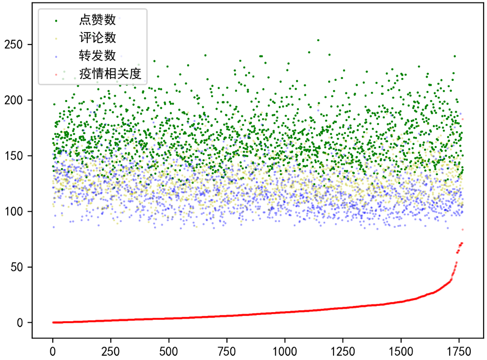
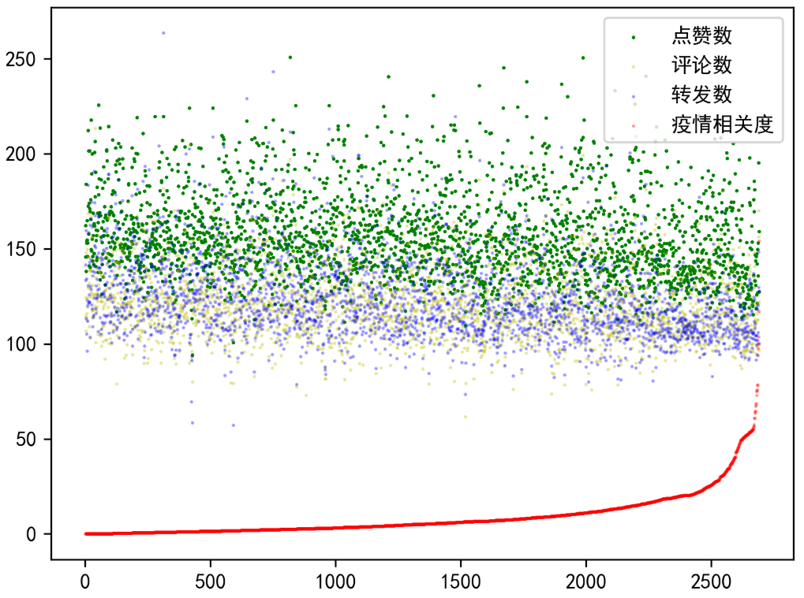
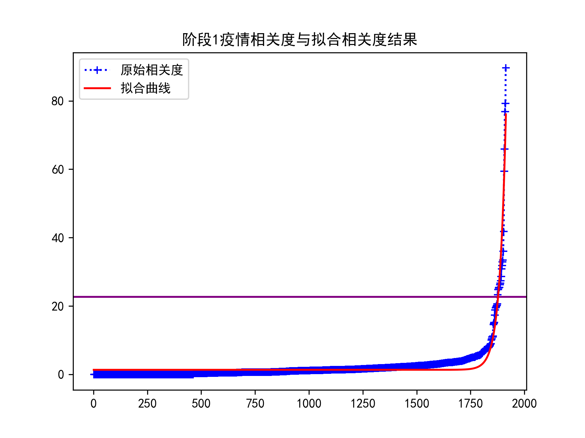
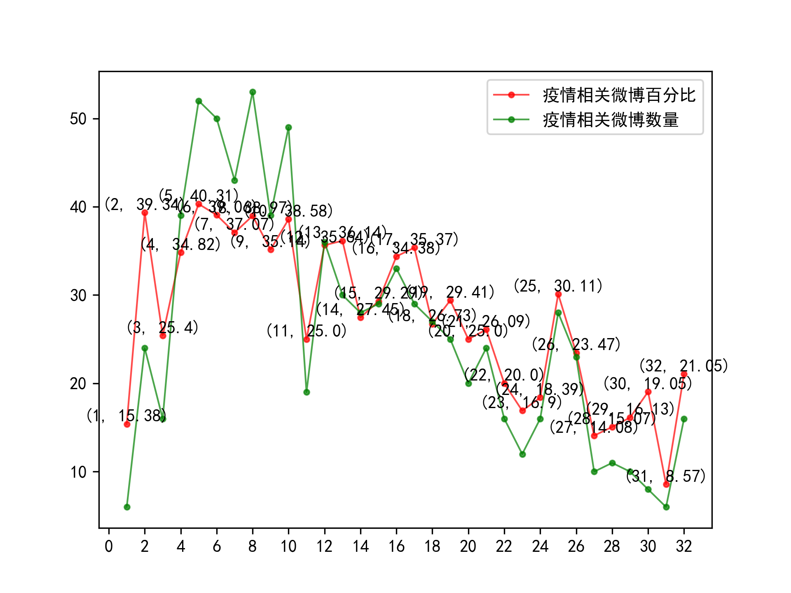
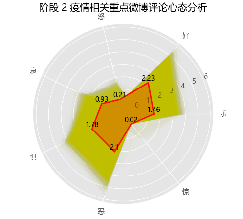
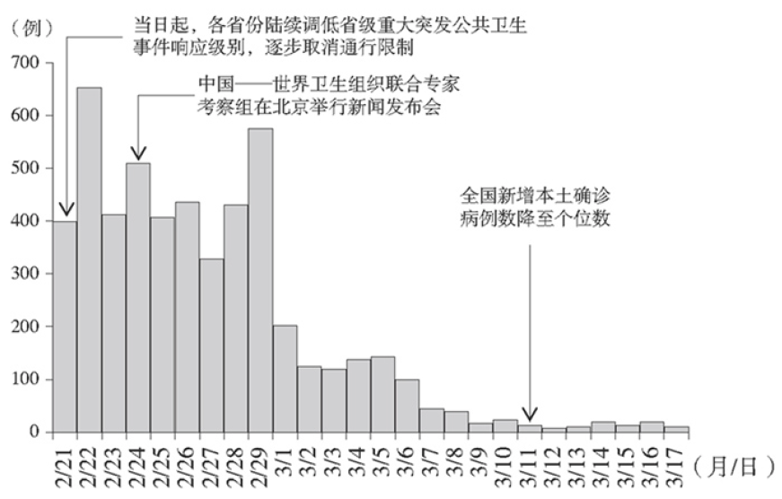
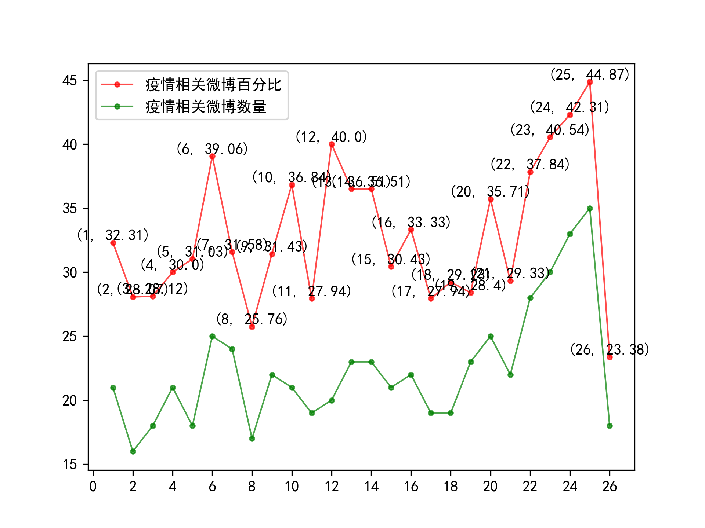
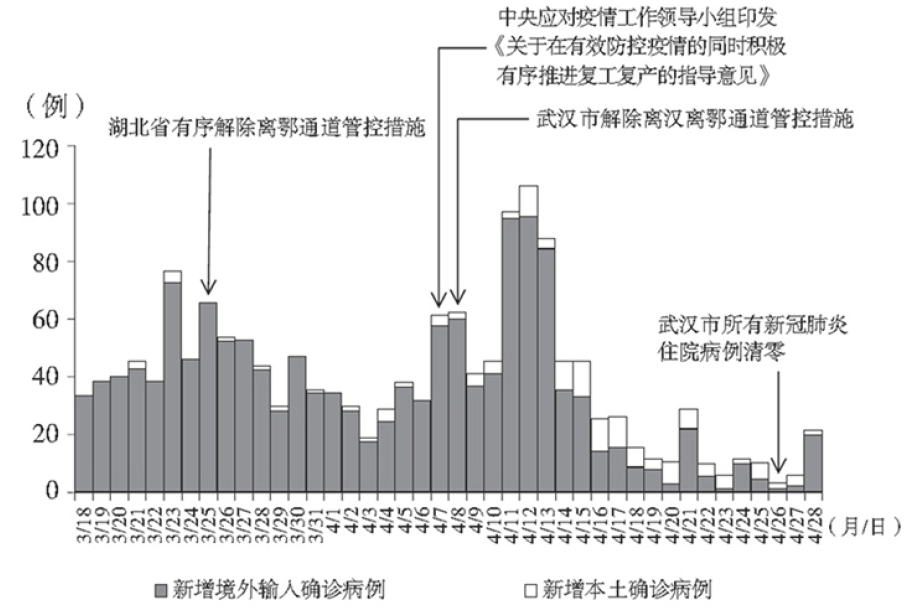

# 案例分析

## （一）概述

在汇总了我们所收集到的几乎所有数据和生成的结果后，我们发现在疫情不同的阶段，有如下带有共性的规律：

### 1. 数据集中微博疫情相关度普遍呈极偏分布

在我们的算法下，阶段0至5，疫情相关度的分布都是极偏的，且用类指数函数拟合效果极为良好。在我么多年的结果中，阶段1的$R^2$ 值为0.92，

> TODO

### 2. 央媒官微与疫情是否相关和其热度没有显著联系

我们对阶段0到5的微博均进行了分析，发现无论是点赞数、评论数还是转发数都和与疫情的相关程度没有显著的联系。央媒作为综合性媒体，报道的新闻内容也绝不仅限于与疫情高度相关的内容，因而我们认为这样的结果也是合理的，但仍略微超出我们的预料。我们本以为这样的现象只在自媒体和特定领域的媒体中出现，但没想到官媒亦是如此。下面的五幅图中的评论数、点赞数和转发数均是以10为底取对数再乘以40以后的结果。

> ###### 阶段0

> ###### 阶段1

> ###### 阶段2

> ###### 阶段3

> ###### 阶段4

> ###### 阶段5

### 3. 微博的“话题”功能可能导致评论区与正文无关的现象的出现

常言道，“微博治国”。由于微博特有的“话题”功能（即“#”号内包括的功能），评论区可能出现在某个话题的引入之后，评论区的关注焦点转移到新引入的话题下面的情况；且有时特定人群在几乎所有的微博下提及某个主题的现象在微博并不罕见。在阶段1，大量的疫情相关重点微博下的评论区都会提到李文亮医生。他们为李文亮医生鸣不平，而这正是疫情之下大众心态的最真实反映。因而在后续研究的过程中，我们不能将视野局限于博文本身。与博文对应的评论区才是我们应该关注的重点。

> TODO 

## （二）阶段0：疫情尚未引起大众注意

我们发现，新冠疫情还不是一个群体性的事件。人们只是在极为有限的渠道了解到，最近出现了一种不明原因的肺炎。在这一阶段，无论是荔枝新闻、人民日报官微还是新浪新闻中，都没有大量的对新冠疫情的描写。在这一阶段，新冠病毒似乎只是一种已被发现并控制的“大号流感”。即使是在我们的分类方法下挑出的相关微博中，也没有一条与新冠疫情真正相关。许多其他因素引起的肺炎占据了了绝大部分，而此处的疫情更多指的是兰州兽研所的布病和猪瘟。这也是为什么这一阶段被称为第0阶段的原因。因而我们将重点放在第零阶段以后的内容。

##  （三）阶段1：迅即应对突发疫情

在这一阶段，对疫情的关注度迅速提高，且随着系列措施的出台，防疫逐渐来到我们每个人的身边。2019年12月27日，湖北省中西医结合医院向武汉市江汉区疾控中心报告不明原因肺炎病例。武汉市组织专家从病情多方面综合分析，认为上述病例系病毒性肺炎。接下来，“病毒性肺炎”被明确为新冠肺炎，且确认人传人现象，国内对疫情的重视程度也是不断上升，甚至到了习近平主席的层级。中国也迅速将疫情通告世卫组织和国际社会，为人类合作抗击新冠疫情提供了宝贵的资料。本阶段的疫情相关词云图如下图所示：

此时，在荔枝新闻中提取疫情相关关键词已经能获得非常好的效果，但在这一阶段，防疫似乎仍只是疾控部门和政府的事，因而在人民日报官微中，疫情相关的重点微博数量并不多，在拟合的时候甚至要取到上0.2百分位时仍然会混入一条无关微博。在图中我们不难看出，除了几个重要的时间节点外，大多数时候人民日报官微中并没有涉及新冠疫情相关内容。社会秩序仍保持相对稳定，人们的关注焦点也更多在其他事情上。

> 疫情相关新闻筛选比例：1.9%

然而在荔枝新闻提取到的内容中，我们发现“武汉”“华南海鲜市场”等词汇已成为官媒关注的重点。一方面，某些地方官员仍在尝试掩盖消息，将部分对真实情况的如实反映当作“谣言”处理，导致疫情在一定程度上的加速扩散，也让政府的公信力在一定程度上被破坏。这其中的典型，便是李文亮事件。但另一方面，也正是在信息不透明的情况下，谣言四处滋生，给社会带来事实上的恐慌与不安。1月4日的词云图中“谣言”更是直接位列榜首。

由于类似前者的事件的出现，政府的“辟谣”行为反而可能会被认为是为了掩盖事实之举，许多人宁可相信阴谋论，也不愿意相信政府发布的消息，进一步壮大了谣言滋生的土壤。真理总是越辩越明的，政府此时应该拿出更切实有力的证据和事实上的防疫成效来证明自己，而非简单地抓人了事。与此同时，防疫工作也确实有许多做得不到位的地方。疫情对全国人民都是一场大考，是几乎所有人都没能预料到的。在对这一阶段的疫情相关评微博评论中的情感倾向也印证了这一点。心态倾向如下图所示：

从上图中我们不难看到在这一阶段，“好”和“乐”的情感被压得很低，而“惧”和“恶”达到了惊人的高度。疫情防控虽然还没来到每个人身边，但是那些遥远的消息却是那么地牵动人心，给人带来哀伤、恐惧与厌恶。政府信息的相对不透明，助长了这些情绪，为疫情防控工作的开展带来了许多不利因素。

## （四）阶段2：初步遏制疫情蔓延势头

毫不夸张地说，这是疫情防控最紧张的阶段，也是疫情从急剧上升到得到初步控制的转折阶段。武汉封城， 全国集中资源和力量驰援湖北省和武汉市。国务院先后建立联防联控机制、复工复产推进工作机制，而各地则启动重大突发公共卫生事件应急响应。最全面最严格最彻底的全国疫情防控正式展开，疫情蔓延势头初步遏制。本阶段的疫情相关关键词词云图如下图所示。

我们发现，我们所获取到的当日微博占比高峰和疫情中的重要时间节点是极为相符的。

> TODO

> 疫情相关重点微博筛选比例：25%

我们不难发现，在2020年1月23日到2020年1月25日，在武汉关闭离汉通道、从各地方及军队调集国家医疗队和中共中央成立疫情工作领导小组并向疫情严重地区派出指导组这三大事件的影响下，疫情相关重点微博占比达到了一个从所未有的高度，在2020年1月28日中央指导组进驻武汉市后，疫情相关重点微博更是达到了最高点。在这几天里，人民日报的官微的热度也是达到了相当的高度。而后随着防控工作的有力推进，疫情相关重点微博占比不断降低。

在这个阶段，评论区对于疫情的心态呈现出鲜明的特点。我们不难发现好和恶是两种最突出的情感。这是因为在疫情中，志愿者与医护人员等奔跑在抗疫一线的“最美逆行者”们是受到高度尊重的，是为人民所喜爱，所拥护的；而另一方面，在疫情中暴露出来的人心丑恶也成为人们所厌恶。在疫情防控明明更为艰苦的时候，评论中的“好”与“乐”却显著上升，体现了群众们苦中作乐的精神。诚然，具有一定舆论引导责任的官媒可能存在故意往积极方向引导的可能性，但这样的引导本身也能在一定程度上作用并反映疫情。评论中无数的“加油”，体现了中国人民在面对疫情时的盎然斗志。面对新冠疫情，人们更多的是感到“惧”而不是“惊”。面对未知的病毒和被封锁掣肘的经济，人们对未来感到强烈的不确定性，并因而感到强烈的恐惧。在1月26日，关于“惧”的情感尤为突出。与此同时，“哀”的情感也表现得十分突出。人们为受新冠疫情影响的地区以及逝者感到哀伤。这些反应也都是出乎人之常情的。在这段时间，也有很多不和谐的声音。在疫情的快速蔓延和各项信息不够公开，各类问题接连暴露的情况下，评论区也时常表达对防疫工作的不满。这一阶段，恰恰是代表政府公信力的官媒所应该更加着力的。如何用事实说服人，如何让人民真切地感到安稳，乃至于加强政府的公信力，对官媒而言是道难关。丢了这道关，官媒在人们心中的地位将会大减；赢得这道关，人们对官媒的信任程度会大为增加。

随着疫情逐步得到控制，“惧”的情感逐步降低，而正面的情绪逐步增加。实际上，这也是国人对防控疫情的信心逐步增强的过程。2020年2月18日，新增出院病例数开始超过新增确诊病例数这一事件的报道，更是让当日的疫情相关重点微博评论心态的“惧”一项降到了0.93，而“好”则达到了3.88。这样的变化是极为显著的。中国政府以强而有力的态度正视疫情、应对疫情，以实力创造了“中国奇迹”证明了中国制度的优越性，促成了评论区心态的转变。我们常赞扬“做了也不一定说”的人而抨击“说了也不一定做的人”，但事实上，肩负着舆论引导作用的官媒，要和国家实际的行动结合起来，既要做，也要说，二者相辅相成，互相促进。到了后期，疫情微博数量和比例的双下降，也印证着疫情防控的成功和高压防疫政策的常态化。

在新冠疫情期间，我们高兴地看到，许多平台开始主动收集疫情相关知识库和谣言集中辟谣场所，并提供消息推送等服务，让人们能更便捷地从相对权威的渠道获取防疫防控的相关信息。例如，支付宝和钉钉这两款软件中便内置了疫情查询功能，而丁香园在这方面则做得更远。丁香园可谓是疫情相关信息提供了一个一站式的解决平台。这固然有一定的商业动机在其中，但是其在社会公益方面的显著效果还是有目共睹的。

## （五）阶段3：本土新增病例数逐步下降至个位数

在该阶段，全国除湖北省以外疫情形势总体平稳。3月中旬起，每日新增病例控制在个位数以内，疫情防控取得阶段性重要成效。根据疫情防控形势发展，中共中央作出统筹疫情防控和经济社会发展、有序复工复产重大决策。因而在该阶段的关键词中，复工复产相关词汇成为关键词中的新宠儿。

> 疫情相关重点微博筛选比例：14%

下图中，3月11日（20, 35.71)的一个波峰，恰对应于全国新增本土确诊病例降到个位数的消息发布。在此后的3月14日、3月15日和3月16日，随着多地新冠疫情病例逐步清零，各地的喜报不断在人民日报官微上发布，对应于下图中最后一个波峰。

在本阶段，随着疫情防控工作取得阶段性成效与复工复产工作的有序开展，人们的生活逐步恢复正常，但同样地，复工复产工作并不是一帆风顺的。政策方向虽出台，但是湖北人，特别是武汉人的处境却仍不大乐观。评论区里，许多人迫切地想知道复工地具体措施，并批评对各地拒绝湖北人的系列政策。我们的心态分析的结果与阶段2的相比，“好”和“乐”的数值有所提高，“恶”与“惧”的数值有所降低。在这一阶段的评论中，我们可以看到许多振奋人心的字眼。

这其中特别值得重视的是本阶段的第一天。2020年2月21日，发生了三件和复工复产工作高度相关的大事：习近平主席主持召开中共中央政治局会议，强调要针对不同区域情况，完善差异化防控策略，强调要建立与疫情防控相适应的经济社会运行秩序，有序推动复工复产；国务院联防联控机制印发《企事业单位复工复产疫情防控措施指南》；各地因地制宜，陆续调低省级重大突发公共卫生事件响应级别，逐步取消通行限制。这是遏制住疫情快速阶段后，逐步解封经济的重要节点。我们对这一天的评论利用机器学习进行了心态分析，发现

> TODO

在2020年3月15日至16日，在多地疫情相继清零的消息传出后，许多人欣喜若狂，在评论区表达着地方自豪感和对他地的希望与祝福。

## （六）阶段4：取得武汉保卫战、湖北保卫战决定性成果

在本阶段，全国本土疫情传播基本阻断，武汉市在院新冠肺炎患者实现清零。在本阶段，境内疫情零星散发，境外疫情快速扩散蔓延，境外输入病例造成关联病例传播成为局部疫情爆发的主要形式。国家确定了“外防输入、内防反弹”的防控策略，巩固深化国内疫情防控成效，及时处置聚集性疫情，分类推动复工复产，让整个中国的发展逐步回到正轨上。《抗击新冠肺炎疫情的中国行动》白皮书中的配图也第一次开始关注境外输入病例，并以不同的颜色显示。

> 疫情相关重点微博筛选比例：8%

在这一阶段，没有什么非常特别的重大公众事件，疫情相关重点微博数量呈下降趋势。

在本阶段，疫情相关重点微博评论心态也开始变得相对稳定。但在评论中也表现出很多对国家对海外归来人员和外国人的优待政策的不满。但在面对国外疫情的时候，对国外的鼓励与祝福与幸灾乐祸的情绪是并存的。

## （七）阶段5和阶段6：全国疫情防控进入常态化

在这一阶段，我国境内疫情已经得到基本控制，总体呈零星散发状态，仅局部地区偶尔出现散发病例引起的聚集性疫情。无症状感染者成为疫情防控的难点，境外输入病例基本得到控制，但无症状感染者以及部分不遵守隔离规定的人的举动为疫情防控带来许多隐患。但在整体而言疫情积极向好态势持续巩固，全国疫情防控进入常态化阶段。

在阶段5，与人民日报与疫情相关的重点微博仍有不少，但其中很大一部分是对境外疫情的报道，对内的报道多以和疫苗以及偶尔零星散发的局部疫情相关。

> 疫情相关重点微博筛选比例：8%

在这一阶段，人们已经对新冠病毒有了相当的认识，“惧”方面的情感降到了自阶段2以来的最低值。评论区的心态趋于平稳，人们也逐渐回到正常的生活当中。

阶段5和阶段6的阶段性疫情相关关键词分别如下图所示。

图中的一些地名，反应的往往是某地的聚集性疫情。由于美国疫情的持续恶化，美国也成为了媒体热议的主题。由于美国此前在前几个阶段对中国抗疫阶段的阴阳怪气或直接指责，在新闻中也往往流露出对美国政府的批评。

事实上，只要全球的疫情尚未结束，中国就必须长期保持警惕。“外防输入，内防访谈”，将会是相当长的时间内防疫工作的工作主题。我们的生活中，各项防疫政策虽然已有一定放松，但是我们仍须时刻保持警惕。新冠病毒是狡猾的，但人类是智慧的。