# 数据科学大作业报告划分与分工表

> 凡是在引号内的都是不直接写到最后报告里的

## 0.0 格式相关内容

**余东骏**

## 0.1 摘要与关键词


# 1. 研究背景

> **余东骏**

## 1.1 社会背景

日益多元复杂的公众情绪随着社会信息化程度的提高与大数据、人工智能等技术的不断普及在网络强大的传播能力下正以前所未有的速度剧烈变化着。互联网的普及让更多人的情感与想法得以在数字空间得到表达与传播，让研究者们能在一定程度上摆脱传统社会心态的调研方式的制约而以数字手段收集原始研究资料，并定量地研究情绪变化的具体过程。当下新型冠状病毒（COVID-19） 肆虐全球，给人们的生产和生活产生了极大影响，也形成了疫情下独特的网络社会心态和公众情绪。因此，若立足此次新型冠状病毒（COVID-19）疫情（下简称新冠疫情），借助适宜的数据与计量手段和NLP（自然语言处理，Natural Language Processing）技术，便可在相对准确地了解新冠疫情这一特殊事件在其自身不同发展阶段对中国大众心态的影响，并对央媒及政府在疫情防控常态化阶段社会心态的引导提出一些参考性意见。

## 1.2 文献综述

> TODO

## 1.3 研究简介

我们首先是基于爬虫技术获取了2020年12月8日至2020年6月20日的人民日报在新浪微博的官方微博的正文与评论与对应时间段新浪新闻的所有标题和2019年3月至2020年12月江苏卫视荔枝新闻所有以“肺炎”为关键词的新闻正文。在这些数据的基础上，我们基于$TextRank$等算法，采取多种统计学方法对采集到的人民日报微博内容及其评论、新浪新闻标题与江苏电视台荔枝新闻等数据源进行疫情相关关键词语料提取与分布分析。而后，我们对人民日报的重点疫情相关微博利用心态词典进行了多种情感的分析，并对荔枝新闻的正文利用机器学习的方式给出积极/消极的情绪极性分析以研究疫情期间大众心态的变，并对我们的成果做了大量可视化工作。最后，我们对这些数据进行综合分析，勾勒出一幅新冠疫情爆发以来中国社会大众心态演变的大致图景。

在研究的过程中，我们把此次新冠疫情大致分为6个阶段：阶段0指的是2019年12月8日武汉卫健委通报首例新冠病例至2020年12月26日；阶段1至5分别对应《抗击新冠肺炎疫情的中国行动》白皮书中的第一至第五阶段，即第一阶段：迅即应对突发疫情（2019年12月27日至2020年1月19日）、第二阶段：初步遏制疫情蔓延势头（2020年1月20日至2020年2月20日）、第三阶段：本土新增病例数逐步下降至个位数（2020年2月21日至2020年3月17日）、第四阶段：取得武汉保卫战、湖北保卫战决定性成果（2020年3月18日至2020年4月28日）和第五阶段：全国疫情防控进入常态化（2020年4月29日至2020年6月20日）；阶段6对应在此之后的时间段（数据最大收集到2020年12月21日）。下文所提及的阶段均为此处阶段分划下的结果。


# 2. 项目的代码实现

## 2.1 爬虫与数据获取部分

> **丛进、余东骏**

我们通过爬虫对新浪微博、江苏电视台荔枝新闻和新浪新闻进行了数据的爬取。这其中，对新浪微博的爬取采用的是通过移动端网页版API（m.weibo.cn）爬取的方式，而对荔枝新闻和新浪新闻的爬取则采用对$html$源码进行解析的方式。详情可以在我们的开源仓库中查看。由于在开发新浪微博爬虫的过程中和郝晨杰同学有密切的合作，故我们在征得对方同意后使用了郝晨杰同学获取的数据。我们获取的数据在经过处理后均为$json$格式的数据，读取和写入十分方便。

## 2.2 数据筛选与统计学分析部分

> **余东骏**

  为了从更细的粒度上考察随着新冠疫情变化而不断变化的社会心态，我们将研究的基本单位定为天。在不同阶段的文件夹下，每一天分割后的原始数据和处理后的数据结果都在阶段文件夹下的对应日期文件夹内，而该阶段整体上的基础信息则写在该阶段文件下。由于不同阶段本身的特点，不同日期内拥有的数据种类可能有所不同，但是总体的命名格式是统一的。例如，在潜在的与疫情相关的关键词的选取上，在第0阶段和第1阶段，荔枝新闻没有对应文章的，关键词生成的源文本就会用新浪新闻的标题做补充。详细情况可以看`data`文件夹下的`README`文件。

我们首先提取了不同阶段的疫情关键词。这一步操作对每一个阶段而言都是分别进行的。首先，我们从以“肺炎”为关键词检索的荔枝新闻正文（部分采用了新浪新闻标题）中分词、去除停用词后对每一天生成了前36个关键词（生成的结果已经归一化，最大权值的词的权值为1），并将数据乘以100后绘制词云图（对所有值下取整后）并存储起来。在这些词云图中，我们可以鲜明地看到每一天的疫情相关新闻的重点的演变。在此基础上，我们将这些结果加和汇总，即相同的词语的权值相加，得到一份较大的关键词表，而后再对这其中的每个词语的权值取10的对数并归一化，得到一份原始疫情相关关键词表。我们发现，这样的设计能有效防止因某个关键词的权值过高（如“新冠”、“肺炎”而导致一出现该词对应文本的最终权重就可能过高），也能避免对所有关键词直接采用$TF-IDF$或者$TextRank$算法时可能会漏掉一些仅在特定日子中出现但却和疫情演变进程密切相关的关键词。$TF-IDF$ 算法中， $TF $表示某个词语在一个语料中出现的频次；$DF$ 表示在全部语料中，共有多少个语料出现了这个词，$IDF$ 是$DF$的倒数(取log)；$TF- IDF$ 越大，表示这个词越重要。该方法常用于提取关键词。$TextRank$根据词语之间的邻近关系构建网络，通过$PageRank$迭代计算出词语的排名；也常用于关键词提取、自动摘要提取等。显然，上面所述步骤里并没有人工的介入，关键词中难免混入一些杂质。因此我们还人工地对这些关键词进行了筛选。

而后，我们在每一阶段的疫情相关关键词的基础上，筛选出与疫情相关度较高的微博作为后面进一步分析的数据源。在这一步骤中，我们先对微博正文进行分词，然后在分词后的结果中一一检索是否有关键词表中的词，如果有，就给该微博的疫情相关度加上该词的权重乘以该词的出现次数。在这一步中，对每条微博的评论进行精简，仅保留前五分之一的评论。在得到所有微博的疫情相关度指标后，将其从小到大排序并进行函数拟合，拟合函数如下：
$$
f ( x ) = a * b^{ x - d } +c
$$
在拟合后，先计算 $MSE$、$RMSE$ 和 $R^2$ 以检验拟合的效果，并绘制对应图像，从图像中观察相关度的分布。与此同时，图像中还绘制了微博相关度由小到大排序后对应的热度（从三个指标来看：点赞数、评论数和转发数）的散点图以探究疫情相关度高低与热度高低之间的关系。

在此之后，我们利用拟合的曲线取某个上百分位点作为阈值(默认选取函数图像上的“拐点”，并加以人工复核与调整），疫情相关度高于该阈值的微博视作为疫情相关重点微博，并将所有疫情相关重点微博存储到对应文件中。与此同时，计算并绘制每日的疫情相关微博占比，以反映当日当日央媒对疫情相关新闻的关注度与当日疫情相关消息的重要程度。在此基础上，我们还探究了点赞数、评论数和转发数这三个热度指标与疫情相关度之间的联系。

在这些步骤进行后，我们在一定程度上掌握了不同阶段下新冠疫情相关信息的分布、热度及重要程度，为下面的分析展开了基础。

## 2.3 心态词典情感分析部分

> **丛进**

### 2.3.1 情感词典的选取

本项目选取的情感词典为《大连理工大学中文情感词汇本体》。（以下简称《情感本体》）

此中文情感词汇本体库是大连理工大学信息检索研究室在林鸿飞教授的指导下经过全体教研室成员的努力整理和标注的一个中文本体资源。该资源从不同角度描述一个中文词汇或者短语，包括词语词性种类、情感类别、情感强度及极性等信息。该库的情感分类体系是在国外比较有影响的Ekman的6大类情感分类体系的基础上构建的。在Ekman的基础上，词汇本体加入情感类别“好”对褒义情感进行了更细致的划分。《情感本体》中的情感共分为7大类：乐、好、怒、哀、惧、恶、惊；大类下一共21小类，例如：安心、祝愿、恐惧、失望、悲伤等。

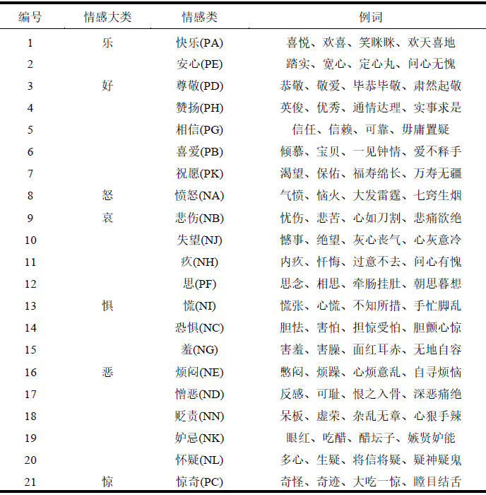

《情感本体》中给出了情感强度，分为1, 3, 5, 7, 9五档，9表示强度最大，1为强度最小。

情感倾向可认为是主体对某一客体主观存在的内心喜恶，内在评价的一种倾向。它由两个方面来衡量：一个情感倾向方向，一个是情感倾向度。《情感本体》中每个词在每一类情感下都对应了一个极性。其中，0代表中性，1代表褒义，2代表贬义。所以，《情感本体》可以用于解决一般的倾向性分析的问题，也可以用于解决多类别情感分类的问题。

### 2.3.2 停用词表的选取

本项目选取的停用词表为《哈工大停用词表》。

### 2.3.3 多情感倾向打分原理

首先，本项目要对文本进行分句、分词。本项目选择的分词工具为 $jieba$。

而后，将分词好的列表数据对应情感词典进行逐个匹配，并记录匹配到的情感词分值。正向的情感词分数+1，负向分情感词分数-1，且程度词会对分数变化有乘数效应，具体算法如下：

#### 1. 情感词
情感词指属于7大类具体的词汇，比如“哈哈”、”害怕“，”我靠“。如果文本中出现了""害怕""这一词汇，假设”害怕“情感强度为7 。则文本的“惧”这一情感的分数+7。

#### 2. 程度词

程度词指修饰情感词强度的词汇：“有点”、“非常”、“十分”等。例如：“非常害怕”，则“惧”的分数+(7+3)，3表示程度词的强度值。

#### 3.否定词

表示否定的词，例如“不”、“没有”、“非”等等。如果文章出现“不害怕”，则文本“惧”这一情感得分-7。

### 2.3.4 单一情感倾向打分原理

单一情感倾向打分即仅计算文本情感极性的过程。遇到极性是中性的词，则文本情感极性+0分；类似地，褒义+1分，贬义-1分。最终计算得分若为正则为积极情感，若为负则为消极情感。在0附近则为中立情感。

### 2.3.5 分数修正

#### 1. 词典情感词数量

基于情感词典的情感判断的准确度，依赖于情感词典的质量和完善程度。《情感本体》中，表示乐，好，怒，哀，惧，恶，惊的词语分别有1967, 10640, 388, 2314, 1179, 10282, 288个。“乐”“恶”词汇的数量比“惊”多2个数量级。所以初始得分中，“恶”的情感得分极大可能性远超”惊“的情感得分。因此本项目根据《情感本体》每种情感的词汇个数，赋予不同权重，词汇数多的赋更少的权，词汇数少的赋予更大的权。权重值为词汇数量的自然对数的倒数。

#### 2. 文本长度

越长的文本，出现情感词的个数越多，情感分数越大。因此本项目对数据进行平滑处理，计算文本总得分后，会除文本长度的自然对数，以消除长文本的影响。

#### 3. 负分情况

文本中若出现较多的否定词，则这一文本的得分便会是负数。在单一情感倾向计算过程中，出现负分就可以认为是消极情感。对于多情感分析，负分可能实际情感并不明确。

本项目的理解是，多情感出现负分，实际上是对立的一种或多种情感得分加强。例如文本是”我不开心了“，根据上面的算法，乐的情感是-5分，其余情感得分是0分。对分数进行修正，乐的分数清零，5分按一定比例分配到情感”哀“、”恶“、“怒”等对立情感中。因此文本的实际得分可能是：”哀“2.0"恶"：2.0"怒":1.0,其余情感0分。

### 2.3.6 分数计算公式

最终得分的计算公式为

$$
adj\_score_i=\frac{initial\_score}{ln(numbers)\cdot ln(text~length)}+\Sigma_{j≠i} weight\cdot|adj\_score_j|
$$

下标$i,j$表示7种情感之一。$inital_score$是统计文本种情感词出现的数量的初始得分；$ln(numbers)$为《情感本体》中某种情感词汇数量的自然对数；$ln(text length)$为文本长度的自然对数；$weight$为情感分数为负分时，分数转移到其他情感的权重（该权重由我们手动确定）；$adj\_score_j$为负分情感的得分。

## 2.4 机器学习部分

> **许礼孟**

### 2.4.1 概述

在成功获取数据后，本项目重点就是如何利用这些数据实现情感的极性分析。目前情感倾向分析的主流方法有两类，其一是基于情感词典，这需要应用到标注好的情感词典，英文语料的各类词典数量庞大，而现有的中文语料的情感词典却不是很多，主要有知网整理的情感词典Hownet和台湾大学整理发布的NTUSD两个情感词典，还有哈工大信息检索研究室开源的《同义词词林》可以用于情感词典的扩充。在实践过程中我们选取了大连理工大学的情感词汇本体库进行基于词典的情感分析（如本文2.3所示），第二种方法则是基于机器学习，其需要大量人工标注的语料作为训练集，并通过提取文本特征，构建分类器模型来实现情感分类。

下图为使用机器学习方法的过程流：

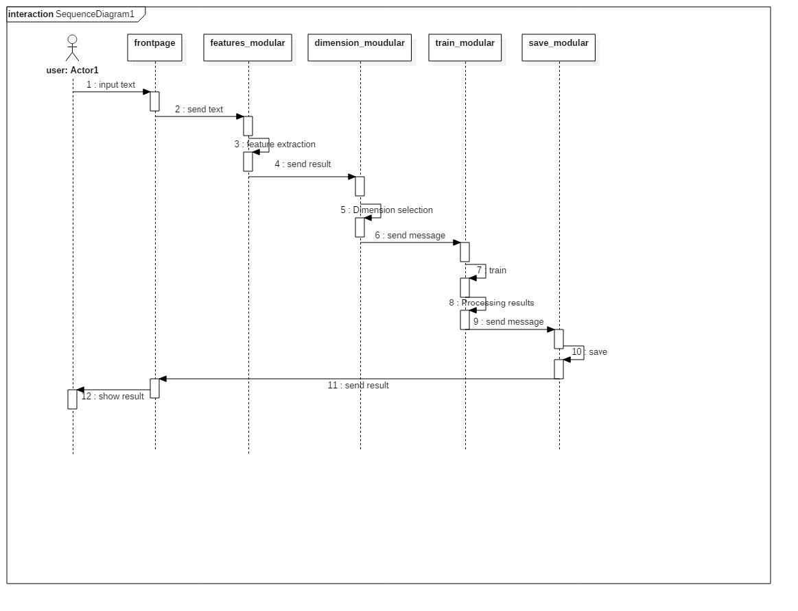

相较于固定的情感词典，机器学习方法的优点就在于其精确度更高。首先，词典匹配会由于语义表达的丰富性而产生很大误差，而机器学习则无需深入到语法层面。其次，词典匹配的方法适用范围更加广泛，因为词典本身所包含的语料就十分丰富；相较而言，机器学习方法对训练集语料的质量依赖性较高，如果训练语料针对性不强，则会严重影响到模型的性能，相反优秀的训练语料会使训练所得模型在特定的预测方向拥有极高的精确度。

Python有很多优秀的适用于情感分类的模块，比如Python自然语言处理包，即Natural Language Toolkit，简称NLTK，本部分中还使用了 $jieba$ 为中文文本的分词工具。             


### 2.4.2 分词部分

我们选择了GitHub上 star数最多的 $jieba$ 分词作为分词工具，其找出基于词频的最大切分组合，有中文分词、关键词提取、词性标注功能，支持自定义词典；采用HMM模型、 Viterbi算法；支持Java，C++，Python语言，性能出色。

### 2.4.3 特征提取 （Feature Extraction）

> Finding collocations requires first calculating the frequencies of words and their appearance in the context of other words. Often the collection of words will then requiring filtering to only retain useful content terms. Each ngram of words may then be scored according to some association measure, in order to determine the relative likelihood of each ngram being a collocation.
>
> ​																																——NLTK 3-5 documentation

在特征提取的过程中，我们分别尝试了直接把每一条文本的所有词作为特征、把文本变成双词搭配的形式，作筛选后作为特征和把所有词和双词搭配一起作为特征等方式。

把文本变成双词搭配的过程中需要调用$ntlk.collection$模块下的$BigramCollocationFinder$类，其中类方法`from_words`可以把文本变成双词搭配的形式。在双词筛选时，可以选择卡方统计、互信息等多种评分方法，`nbest`方法选择分数靠前的1000个双词作为特征。其实，在$ntlk.collection$模块下还有支持三元词的$TrigramCollocationFinder$类和支持四元词的$QuadgramCollocationFinder$类，会适用于更复杂的模型。

### 2.4.4 计算信息量

接下来，为了对特征做筛选，我们需要计算每一个特征（单词或双词）的信息量，保留信息量大的而剔除信息量过小的特征。这样做一来可以降维，减少计算复杂度，二来可以避免过拟合现象，充分提取训练集中的重要特征。具体思路为利用`ntlk.probability`模块下的`FreqDist`类和`ConditionalFreqDist`类来统计每个特征的词频和条件词频，再利用`nltk.metrics`模块下的 `BigramAssocMeasures`类中的`chi_sq`方法以卡方统计的方式计算得分，每个特征的总得分为积极消极得分之和。

#### 卡方检验

特征筛选的目的就是去除无关特征，那么何为无关特征呢？对于分类问题，在过滤式方法中一般假设与标签独立的特征为无关特征，而卡方检验恰好可以进行**独立性检验**，所以其适用于特征选择。如果检验结果是某个特征与标签独立，则可以去除该特征。说到卡方检验自然会用到卡方分布，其定义如下： 

>  设随机变量$x_1$,$x_2$,$…$$x_n$, $i.i.d$~N(0,1),即独立同分布于标准正态分布，那么这 $n$ >个随机变量的平方和：
>
>  $X = \displaystyle \sum^{n}_{i=1}{x_i^2} \tag{1}$
>
>  构成一个新的随机变量，其服从自由度为 $n$ 的卡方分布($\chi^2$分布)，记为$X$~$\chi_n^2$。 	                                         

|              | positive                        | negative                        | word count           |
| ------------ | ------------------------------- | ------------------------------- | -------------------- |
| $word_1$     | $cond\_word\_fd['pos'][word_1]$ | $cond\_word\_fd['neg'][word_1]$ | $word_1\_freq$       |
| $word_2$     | $cond\_word\_fd['pos'][word_2]$ | $cond\_word\_fd['neg'][word2_]$ | $word_2\_freq$       |
| $……$         | $……$                            | $……$                            | $……$                 |
| $word_n$     | $cond\_word\_fd['pos'][word_n]$ | $cond\_word\_fd['neg'][word_n]$ | $word_n\_freq$       |
| $p-n\_count$ | $pos\_word\_count$              | $neg\_word\_count$              | $total\_word\_count$ |

对每一个词，我们做假设检验：

> ​                                           零假设 ($H_0$):  $word_i$与情感极性独立

> ​                                           非零假设（$H_1$)：$word_i$与情感极性不独立

因为零假设是两个变量独立，因此依独立性的定义：$P(A,B) = P(A)P(B)$,上表中每个格子的期望频数$cond\_word\_fd\_expected['pos'/'neg'][word_i]$为$N\times P(A,B) = N\times P(A)\times P(B)$,其中$N$为总量$total\_word\_count$。于是我们又得到了一张新的总体期望频数表：

|              | positive                                  | negative                                  | word count           |
| ------------ | ----------------------------------------- | ----------------------------------------- | -------------------- |
| $word_1$     | $cond\_word\_fd\_expected['pos'][word_1]$ | $cond\_word\_fd\_expected['neg'][word_1]$ | $word_1\_freq$       |
| $word_2$     | $cond\_word\_fd\_expected['pos'][word_2]$ | $cond\_word\_fd\_expected['neg'][word_2]$ | $word_2\_freq$       |
| $……$         | ……                                        | ……                                        | ……                   |
| $word_n$     | $cond\_word\_fd\_expected['pos'][word_n]$ | $cond\_word\_fd\_expected['neg'][word_n]$ | $word_n\_freq$       |
| $p-n\_count$ | $pos\_word\_count$                        | $neg\_word\_count$                        | $total\_word\_count$ |

在得到这两张表之后，就可以针对每个$word_i$计算检验统计量$\chi^2$,$\chi^2$越大，表示观测值和理论值相差越大，该词的信息量就越大。

我们调用了$nltk.BigramAssocMeasures$中的$chi\_sq$评分方法，而$chi\_sq$方法又是利用$phi\_sq$方法实现的。这是基于2×2列联表的卡方统计值（$\chi^2$），与Phi相关系数呈下述关系:

​												$\phi^2 = {\frac{\chi^2}{n}} \tag{2}$

在一个2×2列联表中

```bash
        w1    ~w1
     ------ ------
 w2 | n_ii | n_oi | = n_xi
     ------ ------
~w2 | n_io | n_oo |
     ------ ------
     = n_ix        TOTAL = n_xx
```

可以得出 $w1$ 和 $w2$ 的 Phi相关系数如下：

$\phi = {\frac {n\_ii \cdot n\_oo - n\_io\cdot n\_oi}{\sqrt {n\_ii \cdot n\_oi \cdot n\_io \cdot n\_oo}}} \tag{3}$


统计数所有积极和消极的得分后，将每个词的积极得分和消极得分相加，即得每个词最终的总信息量得分。

### 2.4.5 对特征按信息量排序 

这一步需要对每个特征按照信息量的大小进行排序，取排名靠前的特征作为最终特征，完成筛选。

### 2.4.6 给训练数据打标签 

这一步，我们通过人工标注给训练数据打上标签。

### 2.4.7 训练并测试不同的分类模型

由于时间紧迫，本项目仅人工打了积极消极各212条标签。下面是综合实验结果来看的实现效果。

#### 1. 不同模型

$sklearn.naive_bayes$模块下的$MultinomialNB$模型效果最优。该模型准确率最高，精确率也是最高的，但相应的召回率就比较低了；差准率和查全率的调和均值$fi-score$也比较高。

#### 2. 不同的$n-gram$选取方式

通过对比取所有单个词、只取双词、双词和单词结合的取词方法，发现将双词和单词结合方法最优，但是尽相对于只取单个词的方法在效果上有略微提升，而只取双词的方法则不够理想。值得注意的是，不同的模型对于不同的取词方法的反应也不同，比如$BernoulliNB$模型相对于只取单个词，在单双词都取后其准确率反而有所下降。受限于打好标签的样本数量匮乏，结果可能不够完善。

#### 3. 是否做特征提取

截取信息量丰富的单词后，加以选择合适的维度，准确率相比直接取单词有所上升。例如$BernoulliNB$模型的准确率从0.605提高到了0.9；$MultinomiaNB$模型在本身已经达到0.925的情况下依然提高了1.5%；$LogisticRegression$模型和$NuSVC$模型的准确率也有很大提升。同样的，”直接将所有词和双词搭配“与”信息量丰富的所有词和双词搭配“两个方法做对比也会得到类似的结果。

#### 4. 维度截取

在选取信息量丰富的词时，我们直接截取前$n$维信息量最丰富的词。$n$的大小的选择是一个问题。在测试中我们测试了100维到3000维,发现模型的准确率随着截取维数而逐渐升高，但是又可能会随着维数的继续增加而有所下降。考虑到所给训练集的大小问题，大部分模型在截取过高维时的准确率都趋向稳定（数据太短没有更多维度了）。不同模型的最佳截取维度也不同，一方面要考虑准确率的高低，截取维度不能太低；另一方面要考虑过拟合和计算量问题，截取维度不能太高。

#### 5. ROC 曲线

下图是我们训练所得的最优模型$MultinomialNB$的$ROC$曲线图。6条不同的曲线是用$sklearn.model\_selection$模块下的$StratifiedKFold$类的（$k=6$)交叉验证所得，黑色虚线是平均$ROC$曲线。$area$是$AOC$值。

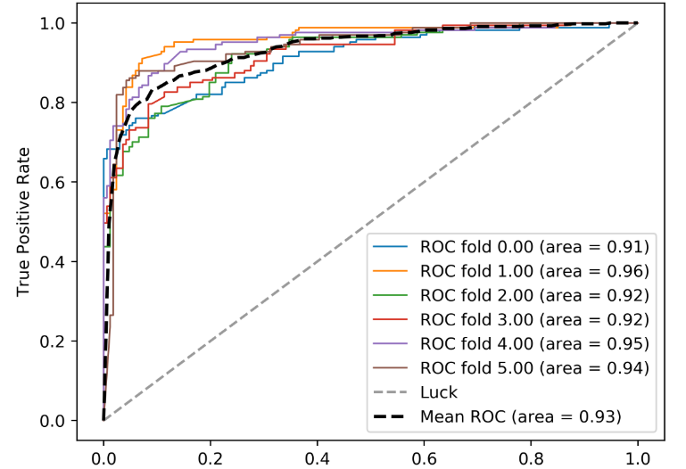


$ROC$（Receiver Operating Characteristic）曲线，以及$AUC$（Area Under Curve），常用来评价一个二值分类器的优劣，$ROC$的横轴为$false positive rate$，**FPR**，“假正例率”，也就是误判为正确的比例；纵轴是$true positive rate$，**TPR**，“真正例率”，也就是正确的判断为正确的比例。

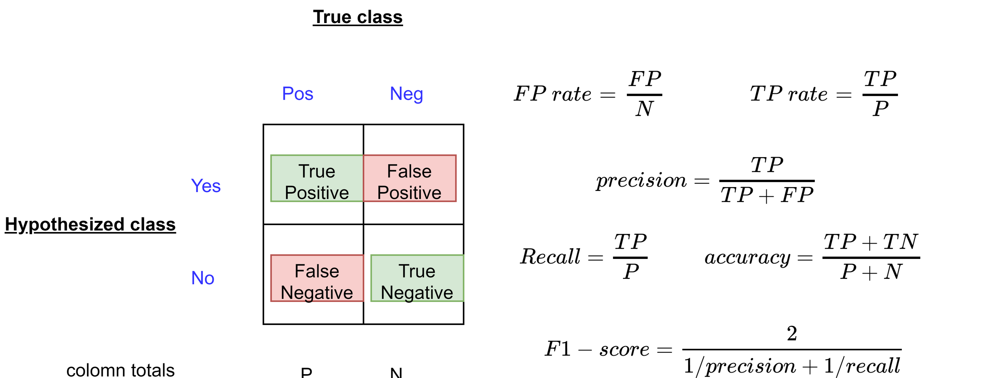

我们重点来看$ROC$曲线图中的四个点和一条线。第一个点，(0,1)，即$FPR$=0, $TPR$=1，这意味着$FN$（false negative）和$FP$（false positive）=0/这是一个理想状况下的完美的分类器，因为它将所有的样本都正确分类了，没有漏判也没有误判。第二个点，(1,0)，即$FPR$=1，$TPR$=0，与前者相反，这是一个最糟糕的分类器，因为它成功避开了所有的正确答案。第三个点，(0,0)，即$FPR$=$TPR$=0，即$FP$（false positive）= $TP$（true positive）= 0，可以发现该分类器预测所有的样本都为负样本（negative）。类似的，第四个点(1,1)，分类器实际上预测所有的样本都为正样本。综上，我们可以断言，$ROC$曲线越接近左上角，该分类器的性能越好。

$AUC$分数是曲线下的面积（Area under curve），越大意味着分类器效果越好。显然这个面积的数值不会大于1。又由于$ROC$曲线一般都处于$y=x$这条直线的上方，所以$AUC$的取值范围在0.5和1之间。使用$AUC$值作为评价标准是因为很多时候$ROC$曲线并不能清晰的说明哪个分类器的效果更好，而$AUC$作为一个数值，评价起来更直观：对应$AUC$更大的分类器效果更好。

​    $ROC$曲线作为关键评价标准之一的一个重要原因在于$ROC$曲线有个很好的特性：当测试集中的正负样本的分布变化的时候，$ROC$曲线能够保持不变。在实际的数据集中经常会出现类不平衡（class imbalance）现象，即负样本比正样本多很多（或者相反），而且测试数据中的正负样本的分布也可能随着时间变化。

作为反面参照，在我们的多角度分析下，也有一些性能不佳的分类器。

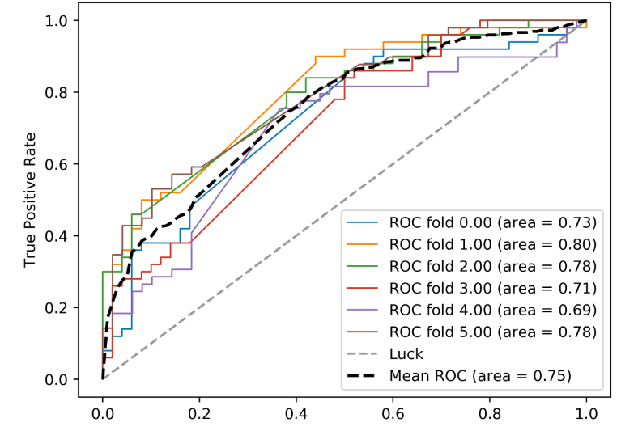

这些表现较差的分类器可以一眼通过$ROC$曲线的走向或者$AUC$的值分辨出来。

### 2.4.8 分析选择最好的方案

最后一步就是选择最优模型并保存。这样就得到了一个经过训练集训练的模型，可以用于之后的数据分析。

# 3. 分阶段案例分析

## 3.1 概述

在汇总了我们所收集到的几乎所有数据和生成的结果后，我们发现在疫情不同的阶段，有如下带有共性的规律：

### 3.1.1 数据集中微博疫情相关度普遍呈极偏分布

在我们的算法下，阶段0至5，微博的疫情相关度指数的分布都是极偏的，且用类指数函数拟合效果极为良好。具体的拟合效果会在每一阶段的分析中展示。

### 3.1.2 央媒官微与疫情是否相关和其热度没有显著联系

我们对阶段0到5的微博均进行了分析，发现无论是点赞数、评论数还是转发数都和与疫情的相关程度没有显著的联系。央媒作为综合性媒体，报道的新闻内容也绝不仅限于与疫情高度相关的内容，因而我们认为这样的结果也是合理的，但仍略微超出我们的预料。我们本以为这样的现象只在自媒体和特定领域的媒体中出现，但没想到官媒亦是如此。下面的五幅图中的评论数、点赞数和转发数均是以10为底取对数再乘以40以后的结果。


> ###### 阶段0


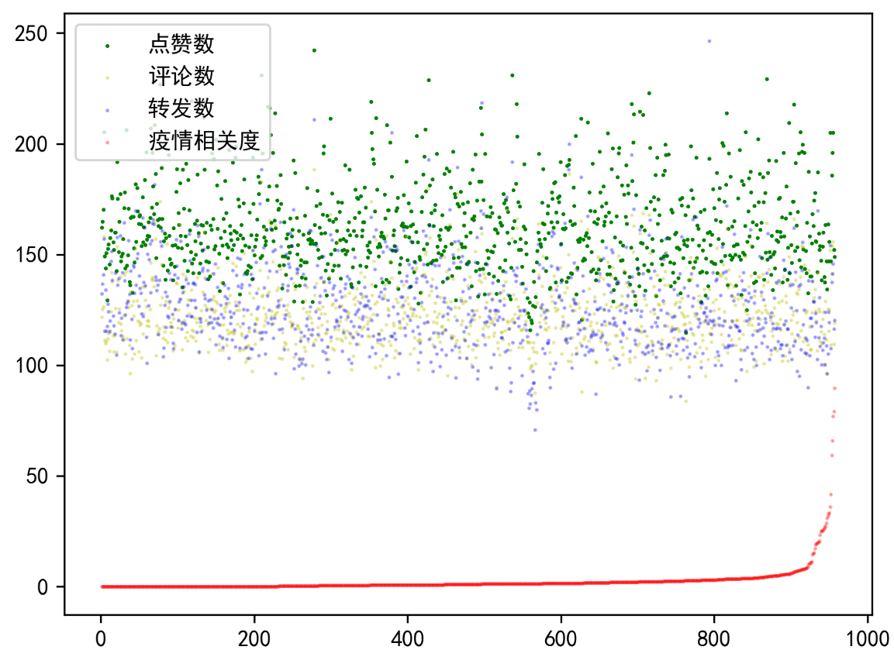

> ###### 阶段1


> ###### 阶段2


> ###### 阶段3


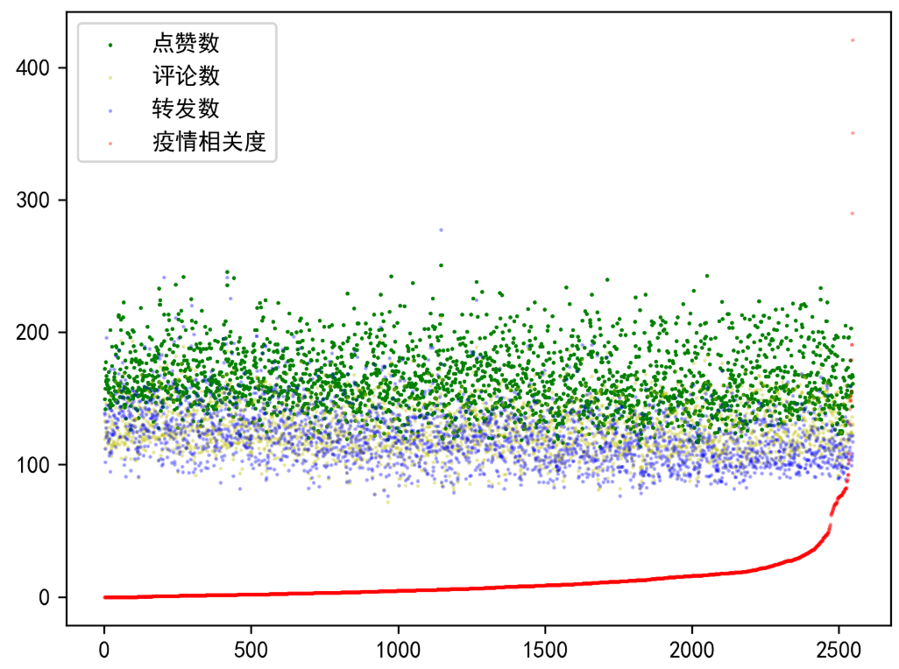

> ###### 阶段4


> ###### 阶段5


### 3.1.3 微博的“话题”功能可能导致评论区与正文无关的现象的出现

常言道，“微博治国”。由于微博特有的“话题”功能（即“#”号内包括的功能），评论区可能出现在某个话题的引入之后，评论区的关注焦点转移到新引入的话题下面的情况；且有时特定人群在几乎所有的微博下提及某个主题的现象在微博并不罕见。在阶段1，大量的疫情相关重点微博下的评论区都会提到李文亮医生。他们为李文亮医生鸣不平，而这正是疫情之下大众心态的最真实反映。因而在后续研究的过程中，我们不能将视野局限于博文本身。与博文对应的评论区才是我们应该关注的重点。

## 3.2 阶段0：疫情尚未引起大众注意

我们发现，新冠疫情还不是一个群体性的事件。人们只是在极为有限的渠道了解到，最近出现了一种不明原因的肺炎。在这一阶段，无论是荔枝新闻、人民日报官微还是新浪新闻中，都没有大量的对新冠疫情的描写。在这一阶段，新冠病毒似乎只是一种已被发现并控制的“大号流感”。即使是在我们的分类方法下挑出的相关微博中，也没有一条与新冠疫情真正相关。许多其他因素引起的肺炎占据了了绝大部分，而此处的疫情更多指的是兰州兽研所的布病和猪瘟。这也是为什么这一阶段被称为第0阶段的原因。因而我们将重点放在第零阶段以后的内容。


##  3.3 阶段1：迅即应对突发疫情

在这一阶段，对疫情的关注度迅速提高，且随着系列措施的出台，防疫逐渐来到我们每个人的身边。2019年12月27日，湖北省中西医结合医院向武汉市江汉区疾控中心报告不明原因肺炎病例。武汉市组织专家从病情多方面综合分析，认为上述病例系病毒性肺炎。接下来，“病毒性肺炎”被明确为新冠肺炎，且确认人传人现象，国内对疫情的重视程度也是不断上升，甚至到了习近平主席的层级。中国也迅速将疫情通告世卫组织和国际社会，为人类合作抗击新冠疫情提供了宝贵的资料。本阶段的疫情相关词云图如下图所示：


此时，在荔枝新闻中提取疫情相关关键词已经能获得非常好的效果，但在这一阶段，防疫似乎仍只是疾控部门和政府的事，因而在人民日报官微中，疫情相关的重点微博数量并不多，在拟合的时候甚至要取到上0.2百分位时仍然会混入一条无关微博。在图中我们不难看出，除了几个重要的时间节点外，大多数时候人民日报官微中并没有涉及新冠疫情相关内容。社会秩序仍保持相对稳定，人们的关注焦点也更多在其他事情上。


> 疫情相关新闻筛选比例：1.9%


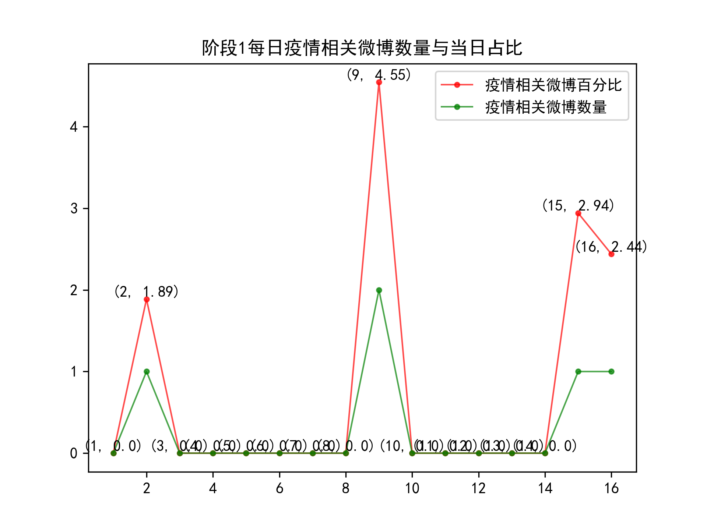

然而在荔枝新闻提取到的内容中，我们发现“武汉”“华南海鲜市场”等词汇已成为官媒关注的重点。一方面，某些地方官员仍在尝试掩盖消息，将部分对真实情况的如实反映当作“谣言”处理，导致疫情在一定程度上的加速扩散，也让政府的公信力在一定程度上被破坏。这其中的典型，便是李文亮事件。但另一方面，也正是在信息不透明的情况下，谣言四处滋生，给社会带来事实上的恐慌与不安。1月4日的词云图中“谣言”更是直接位列榜首。


由于类似前者的事件的出现，政府的“辟谣”行为反而可能会被认为是为了掩盖事实之举，许多人宁可相信阴谋论，也不愿意相信政府发布的消息，进一步壮大了谣言滋生的土壤。真理总是越辩越明的，政府此时应该拿出更切实有力的证据和事实上的防疫成效来证明自己，而非简单地抓人了事。与此同时，防疫工作也确实有许多做得不到位的地方。疫情对全国人民都是一场大考，是几乎所有人都没能预料到的。在对这一阶段的疫情相关评微博评论中的情感倾向也印证了这一点。心态倾向如下图所示：

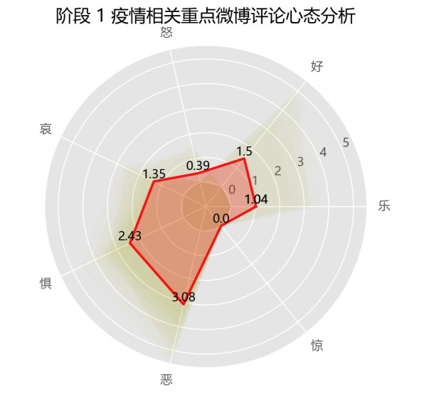

从上图中我们不难看到在这一阶段，“好”和“乐”的情感被压得很低，而“惧”和“恶”达到了惊人的高度。疫情防控虽然还没来到每个人身边，但是那些遥远的消息却是那么地牵动人心，给人带来哀伤、恐惧与厌恶。政府信息的相对不透明，助长了这些情绪，为疫情防控工作的开展带来了许多不利因素。

## 3.4 阶段2：初步遏制疫情蔓延势头

毫不夸张地说，这是疫情防控最紧张的阶段，也是疫情从急剧上升到得到初步控制的转折阶段。武汉封城， 全国集中资源和力量驰援湖北省和武汉市。国务院先后建立联防联控机制、复工复产推进工作机制，而各地则启动重大突发公共卫生事件应急响应。最全面最严格最彻底的全国疫情防控正式展开，疫情蔓延势头初步遏制。本阶段的疫情相关关键词词云图如下图所示。


我们发现，我们所获取到的当日微博占比高峰和疫情中的重要时间节点是极为相符的。

> TODO

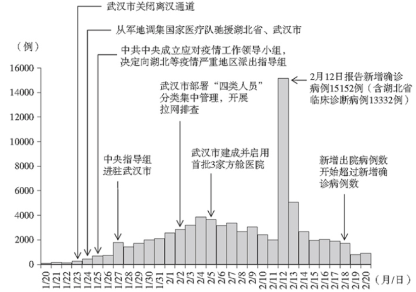


> 疫情相关重点微博筛选比例：25%

我们不难发现，在2020年1月23日到2020年1月25日，在武汉关闭离汉通道、从各地方及军队调集国家医疗队和中共中央成立疫情工作领导小组并向疫情严重地区派出指导组这三大事件的影响下，疫情相关重点微博占比达到了一个从所未有的高度，在2020年1月28日中央指导组进驻武汉市后，疫情相关重点微博更是达到了最高点。在这几天里，人民日报的官微的热度也是达到了相当的高度。而后随着防控工作的有力推进，疫情相关重点微博占比不断降低。


在这个阶段，评论区对于疫情的心态呈现出鲜明的特点。我们不难发现好和恶是两种最突出的情感。这是因为在疫情中，志愿者与医护人员等奔跑在抗疫一线的“最美逆行者”们是受到高度尊重的，是为人民所喜爱，所拥护的；而另一方面，在疫情中暴露出来的人心丑恶也成为人们所厌恶。在疫情防控明明更为艰苦的时候，评论中的“好”与“乐”却显著上升，体现了群众们苦中作乐的精神。诚然，具有一定舆论引导责任的官媒可能存在故意往积极方向引导的可能性，但这样的引导本身也能在一定程度上作用并反映疫情。评论中无数的“加油”，体现了中国人民在面对疫情时的盎然斗志。面对新冠疫情，人们更多的是感到“惧”而不是“惊”。面对未知的病毒和被封锁掣肘的经济，人们对未来感到强烈的不确定性，并因而感到强烈的恐惧。在1月26日，关于“惧”的情感尤为突出。与此同时，“哀”的情感也表现得十分突出。人们为受新冠疫情影响的地区以及逝者感到哀伤。这些反应也都是出乎人之常情的。在这段时间，也有很多不和谐的声音。在疫情的快速蔓延和各项信息不够公开，各类问题接连暴露的情况下，评论区也时常表达对防疫工作的不满。这一阶段，恰恰是代表政府公信力的官媒所应该更加着力的。如何用事实说服人，如何让人民真切地感到安稳，乃至于加强政府的公信力，对官媒而言是道难关。丢了这道关，官媒在人们心中的地位将会大减；赢得这道关，人们对官媒的信任程度会大为增加。


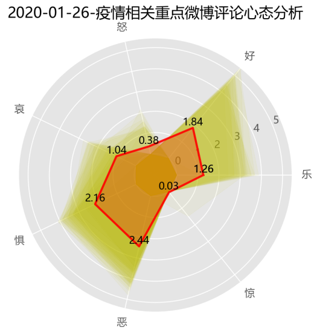

随着疫情逐步得到控制，“惧”的情感逐步降低，而正面的情绪逐步增加。实际上，这也是国人对防控疫情的信心逐步增强的过程。2020年2月18日，新增出院病例数开始超过新增确诊病例数这一事件的报道，更是让当日的疫情相关重点微博评论心态的“惧”一项降到了0.93，而“好”则达到了3.88。这样的变化是极为显著的。中国政府以强而有力的态度正视疫情、应对疫情，以实力创造了“中国奇迹”证明了中国制度的优越性，促成了评论区心态的转变。我们常赞扬“做了也不一定说”的人而抨击“说了也不一定做的人”，但事实上，肩负着舆论引导作用的官媒，要和国家实际的行动结合起来，既要做，也要说，二者相辅相成，互相促进。到了后期，疫情微博数量和比例的双下降，也印证着疫情防控的成功和高压防疫政策的常态化。

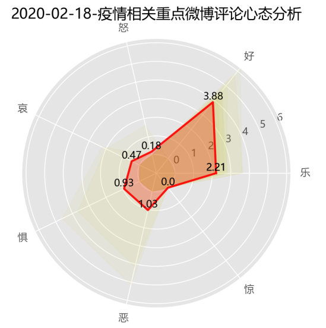


在新冠疫情期间，我们高兴地看到，许多平台开始主动收集疫情相关知识库和谣言集中辟谣场所，并提供消息推送等服务，让人们能更便捷地从相对权威的渠道获取防疫防控的相关信息。例如，支付宝和钉钉这两款软件中便内置了疫情查询功能，而丁香园在这方面则做得更远。丁香园可谓是疫情相关信息提供了一个一站式的解决平台。这固然有一定的商业动机在其中，但是其在社会公益方面的显著效果还是有目共睹的。

## 3.5 阶段3：本土新增病例数逐步下降至个位数

在该阶段，全国除湖北省以外疫情形势总体平稳。3月中旬起，每日新增病例控制在个位数以内，疫情防控取得阶段性重要成效。根据疫情防控形势发展，中共中央作出统筹疫情防控和经济社会发展、有序复工复产重大决策。因而在该阶段的关键词中，复工复产相关词汇成为关键词中的新宠儿。


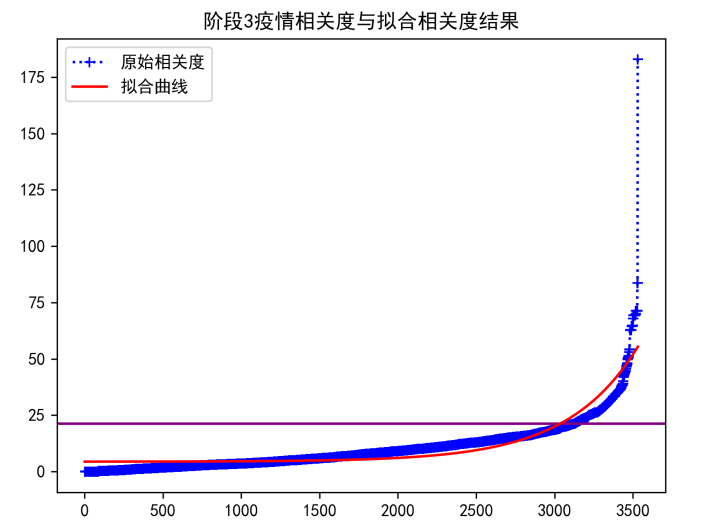

> 疫情相关重点微博筛选比例：14%

下图中，3月11日（20, 35.71)的一个波峰，恰对应于全国新增本土确诊病例降到个位数的消息发布。在此后的3月14日、3月15日和3月16日，随着多地新冠疫情病例逐步清零，各地的喜报不断在人民日报官微上发布，对应于下图中最后一个波峰。


在本阶段，随着疫情防控工作取得阶段性成效与复工复产工作的有序开展，人们的生活逐步恢复正常，但同样地，复工复产工作并不是一帆风顺的。政策方向虽出台，但是湖北人，特别是武汉人的处境却仍不大乐观。评论区里，许多人迫切地想知道复工地具体措施，并批评对各地拒绝湖北人的系列政策。我们的心态分析的结果与阶段2的相比，“好”和“乐”的数值有所提高，“恶”与“惧”的数值有所降低。在这一阶段的评论中，我们可以看到许多振奋人心的字眼。

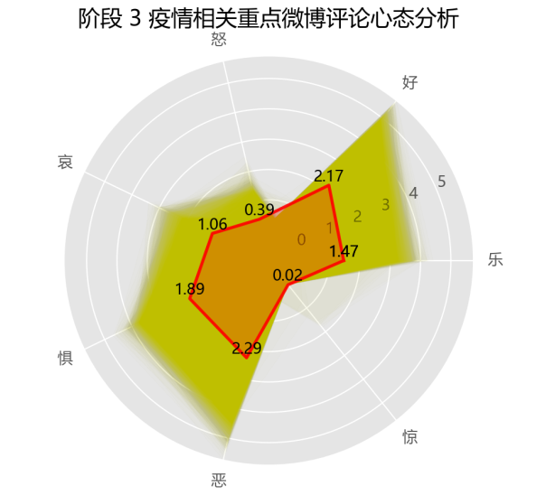


这其中特别值得重视的是本阶段的第一天。2020年2月21日，发生了三件和复工复产工作高度相关的大事：习近平主席主持召开中共中央政治局会议，强调要针对不同区域情况，完善差异化防控策略，强调要建立与疫情防控相适应的经济社会运行秩序，有序推动复工复产；国务院联防联控机制印发《企事业单位复工复产疫情防控措施指南》；各地因地制宜，陆续调低省级重大突发公共卫生事件响应级别，逐步取消通行限制。这是遏制住疫情快速阶段后，逐步解封经济的重要节点。我们对这一天的评论利用机器学习进行了心态分析，发现


在2020年3月15日至16日，在多地疫情相继清零的消息传出后，许多人欣喜若狂，在评论区表达着地方自豪感和对他地的希望与祝福。


## 3.6 阶段4：取得武汉保卫战、湖北保卫战决定性成果

在本阶段，全国本土疫情传播基本阻断，武汉市在院新冠肺炎患者实现清零。在本阶段，境内疫情零星散发，境外疫情快速扩散蔓延，境外输入病例造成关联病例传播成为局部疫情爆发的主要形式。国家确定了“外防输入、内防反弹”的防控策略，巩固深化国内疫情防控成效，及时处置聚集性疫情，分类推动复工复产，让整个中国的发展逐步回到正轨上。《抗击新冠肺炎疫情的中国行动》白皮书中的配图也第一次开始关注境外输入病例，并以不同的颜色显示。


> 疫情相关重点微博筛选比例：8%

在这一阶段，没有什么非常特别的重大公众事件，疫情相关重点微博数量呈下降趋势。

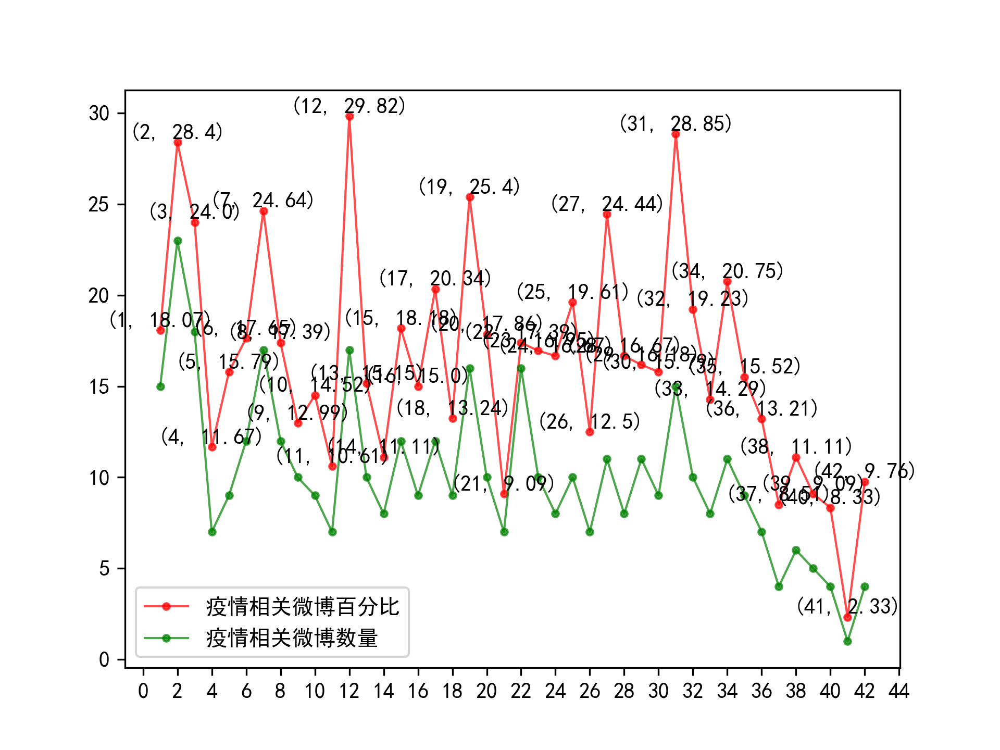

在本阶段，疫情相关重点微博评论心态也开始变得相对稳定。但在评论中也表现出很多对国家对海外归来人员和外国人的优待政策的不满。但在面对国外疫情的时候，对国外的鼓励与祝福与幸灾乐祸的情绪是并存的。

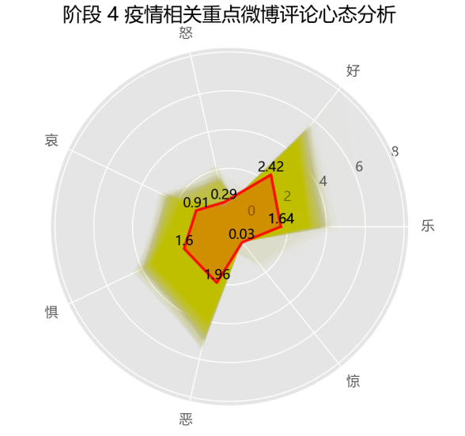

## 3.7 阶段5和阶段6：全国疫情防控进入常态化

在这一阶段，我国境内疫情已经得到基本控制，总体呈零星散发状态，仅局部地区偶尔出现散发病例引起的聚集性疫情。无症状感染者成为疫情防控的难点，境外输入病例基本得到控制，但无症状感染者以及部分不遵守隔离规定的人的举动为疫情防控带来许多隐患。但在整体而言疫情积极向好态势持续巩固，全国疫情防控进入常态化阶段。

在阶段5，与人民日报与疫情相关的重点微博仍有不少，但其中很大一部分是对境外疫情的报道，对内的报道多以和疫苗以及偶尔零星散发的局部疫情相关。

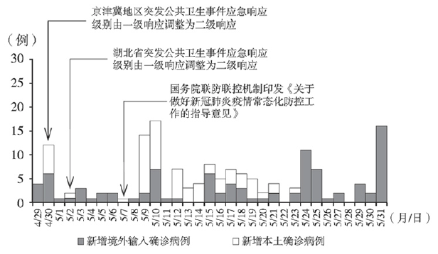


> 疫情相关重点微博筛选比例：8%


在这一阶段，人们已经对新冠病毒有了相当的认识，“惧”方面的情感降到了自阶段2以来的最低值。评论区的心态趋于平稳，人们也逐渐回到正常的生活当中。


阶段5和阶段6的阶段性疫情相关关键词分别如下图所示。


图中的一些地名，反应的往往是某地的聚集性疫情。由于美国疫情的持续恶化，美国也成为了媒体热议的主题。由于美国此前在前几个阶段对中国抗疫阶段的阴阳怪气或直接指责，在新闻中也往往流露出对美国政府的批评。

事实上，只要全球的疫情尚未结束，中国就必须长期保持警惕。“外防输入，内防访谈”，将会是相当长的时间内防疫工作的工作主题。我们的生活中，各项防疫政策虽然已有一定放松，但是我们仍须时刻保持警惕。新冠病毒是狡猾的，但人类是智慧的。

# 4. 总结

> **余东骏**

# 5. 参考资料

> **余东骏**

spaCy的分词步骤，https://spacy.io/usage/spacy-101#language-data

nltk 3.5 documentation http://www.nltk.org/index.html

jieba分词，https://github.com/fxsjy/jieba

HanLP, https://github.com/hankcs/HanLP

华天清，《中文分词方法和软件工具汇总笔记》，https://zhuanlan.zhihu.com/p/86322679

崔庆才，《中文分词原理及工具》，https://cuiqingcai.com/5844.html

$massquantity$, 特征选择： 卡方检验、F 检验和互信息,https://www.cnblogs.com/massquantity/p/10486904.html

基于酒店评论的情感分析，https://github.com/yirui-wang-0212/NLP-SentimentAnalysisForChineseText


# 6. 研究感想

> **余东骏**

# 7. 附录

> **余东骏**

> #### 筛选后的文件目录
>
> 文件按照`stage`划分，其中`stage` 1 - 5按照《抗击疫情的中国行动》划分，`stage0`为2019年12月8日发现首例新冠病例到2019年12月26日，`stage6`是2020年6月21日至2020年12月20日。
>
> ##### stage内文件目录结构
>
> ```bash
> │  COVkeywords-Stage<No>-.json # 人工筛选后的疫情相关关键词
> │  COVkeywords-Stage<No>.json  # 未经筛选的疫情关键词
> │  keywords-Stage<No>.json	   # 从荔枝新闻中获取的原始结果
> │  ratioByDate.png			   # 该阶段内每日疫情相关重点微博占比
> │  SaveTest.png				   # 疫情相关度分布拟合结果图1
> │  SaveTest_Fit.png			   # 疫情相关度分布拟合结果图2
> │  stageCOVWeibo.json		   # 该阶段内疫情相关重点微博（按时间先后排序）
> │  stageCOVWeiboByImportance.json	# 该阶段内疫情相关重点微博（按疫情相关度排序）
> │  stageInfo.json			   # 该阶段基础信息
> │
> ├─YYYY-MM-DD-
> ├─YYYY-MM-DD-
> ├─YYYY-MM-DD-
> ├─YYYY-MM-DD-
> ...
> └─YYYY-MM-DD-
> ```
>
> ##### 每个日期内文件目录结构
>
> ```bash
> YYYY-MM-DD 
> | jstvRAW.csv # 疫情相关关键词检索得到的荔枝新闻原始数据
> | <YYYY-MM-DD->keywords.json # 荔枝新闻正文提取出来的关键词及其乘以100以后的TextRank权值
> | <YYYY-MM-DD->wordcloud.html # 由荔枝新闻生成的词云图
> | <YYYY-MM-DD->blog-Scored.json # 每篇微博都有一个疫情相关度
> | <YYYY-MM-DD->blog-COV.json # 筛选后的新冠疫情相关微博
> | <YYYY-MM-DD->blogInfo.json # 当日博客相关基础信息
> | <YYYY-MM-DD->weiboEmotion.png # 基于心态词典的当日疫情相关微博重点评论情感分析生成的雷达图
> └─<YYYY-MM-DD->weiboEmotion.csv # 基于心态词典的当日疫情相关微博重点评论情感分析原始数据
> ```


# * 报告汇总

传了一轮大家都觉得没问题后YDJSIR进行最终汇总，复核后再无问题之后最后提交。

> 数据分析和代码实现

## * PPT制作与汇报

再行商议